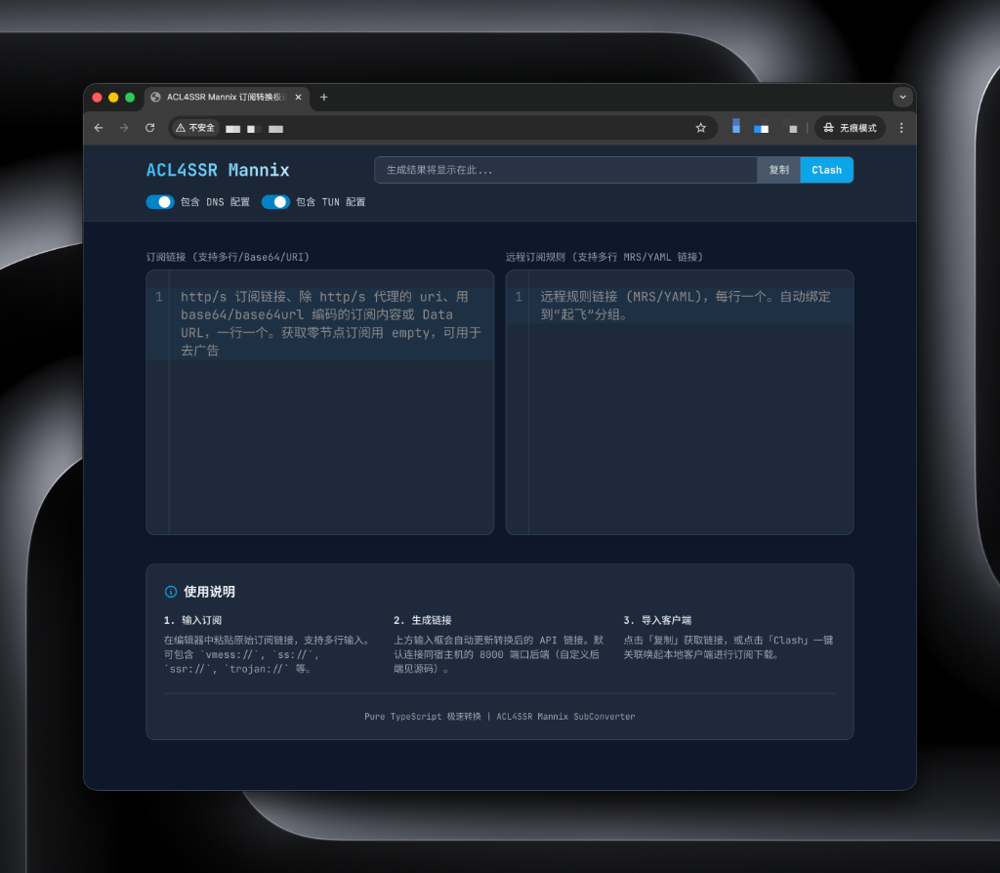

# ACL4SSR Mannix 订阅转换极速版 Web 前端



后端：[ACL4SSR Mannix 订阅转换极速版](https://github.com/zsokami/cvt)

指定后端地址用 `#...`
```
https://sub.com.mp/#http://127.0.0.1:8000
```

## 新增特性 (Custom Enhancements)

- **双编辑器界面**: 现支持同时输入“订阅链接”与“远程订阅规则”，支持多行 MRS/YAML 链接。
- **深色模式深度适配**: 优化了编辑器在深色模式下的字体颜色与对比度，确保视觉体验一致。
- **布局稳定性优化**: 修复了窄屏下编辑器缩窄的问题，统一了编辑器与底部说明的宽度对齐。
- **零节点容错**: 配合后端优化，确保生成的链接在任何情况下均可正常打开（不返回 404）。
